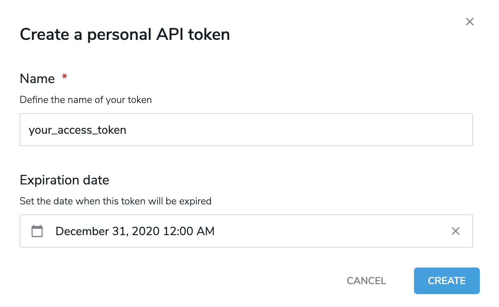

---
page:
  $path: /sites/academy/home/documentation/jahia/8_2/developer/cms-security/using-personal-api-tokens
  jcr:title: Using personal API tokens
  j:templateName: documentation
content:
  $subpath: document-area/content
publish: false
---

With the [personal API tokens module](https://store.jahia.com/contents/modules-repository/org/jahia/modules/personal-api-tokens.html), you can use tokens instead of your credentials to make calls to Jahia APIs, such as GraphQL API and others.

Personal API tokens provide many benefits, including isolation of security credentials between various usages and platforms. While a username and password are unique for a specific user, many security tokens can be attached to an individual user. If a token is considered compromised, that single token can easily be disabled or deleted to prevent its future use without impacting any platforms using other tokens generated for that user. Alternatively, dealing with compromised username and password credentials involves modifying those credentials on all multiple platforms.

As a best practice, Jahia recommends that you create a separate token for each external service that needs to interact with the system APIs. This makes it easier for you to manage tokens that are compromised or lost.

When created, a token is attached to its “creator” user and benefits from the same level of authorization as its creator. For this reason, treat tokens with the same level of precaution as traditional credentials.

## Installing the module

The personal API tokens module (module ID: personal-api-tokens) is compatible with Jahia 8.0.1.0 and above and can be easily installed by adding the module in Jahia Administration>Modules and Extensions>Modules. For information on adding the module, see the [Installing a module tutorial](https://academy.jahia.com/training-kb/tutorials/administrators/installing-a-module).

Existing tokens are stored in the JCR and persist across Jahia upgrades as well as module upgrades.

### Compatibility

The Personal API tokens module is compatible with Jahia 8.0.1.0 with some limitations, and supports the entire feature set from Jahia 8.0.2.0. With Jahia 8.0.1.0, automatically deleting Groovy scripts when creating and managing tokens through the filesystem is not available. All other functionality, such as creating and using tokens through the UI or API, is supported.

## Creating a token

Tokens are active by default and can easily be disabled from the tokens list.

:::info
Access to the "My API tokens" page is restricted to users with permission "Personal api tokens" as a "Server role". Adding "Personal api tokens" permission to "Live role" or "Edit role" is not sufficient for a user to create and manage tokens.
:::

To create a token:

1. In Jahia, navigate to **Dashboard>My API tokens**.
2. Click **Create Token**.
3. In the Create a personal API token dialog, provide the following information:
      - **Name**  
        The name of the token is unique for each user. It is used only for token management purposes to identify the token’s purpose by the user. 
      - **Expiration date**  
        The expiry date is the date after which any calls to the API are deemed invalid. Once the expiry date is reached, tokens are not deleted and are not usable unless you update the expiration date to a later date.  
     
     
4. Click **Create**. The token displays on the page. This is **the only time** the token is visible to you. This token string is a sensitive piece of information. Make sure to keep it safe.

   
5. To copy the token, click **Copy**. Then copy the token value to a safe location.
6. Click **Close**.

The token displays in the list of tokens on the **My API tokens** page.

## Using tokens

You can simply pass a token in the `authorization` header in any API call by prefixing it with `APIToken`.

For example, the Apollo client would be instantiated like this in Typescript:

```typescript
export const apolloClient = (token: string): ApolloClient => {
    return new ApolloClient({
        link: new HttpLink({
            uri: `JAHIA_URL/modules/graphql`,
            headers: {
              authorization: `APIToken ${token}`
            }
        }),
        cache: new InMemoryCache(),
        defaultOptions: {
            query: {
                fetchPolicy: 'no-cache',
            },
        },
    })
}
```

Or, to retrieve the result of the healthcheck, it would be like that:

```bash
curl -H "Authorization: APIToken XXXXXXXXXX" JAHIA_URL/modules/healthcheck
```

## Managing tokens

:::info
Access to the "My API tokens" page is restricted to users with permission "Personal api tokens"
:::

Tokens that you create display on the **My API tokens** page. The list shows information such as the name of the token, its access key, and expiration date. You can delete, activate and disable tokens from this page.


:::infos
**Note:** Tokens are only visible to users once when they are created. None of the information provided here is sufficient to perform an API call.
:::

To delete a token:

1. Click **Delete** under **Actions** beside the token that you want to delete.
2. In the Confirmation dialog, click **Delete Forever**.

Once deleted, a token is gone forever and subsequent API calls using that token are denied.

To activate or disable a token:

Click the **More actions** button under **Actions** and select **Activate** or **Disable**.  
The status changes to **Active** or **Disabled** for the token. Any API call using a disable token is denied.

## Managing tokens for other users

:::info
Access to the "User API tokens" page is restricted to users with permission "Server Administration > Admin personal api tokens"
:::

Although you cannot create tokens for other users, you can delete, activate, and disable tokens that you have permissions to view.

To manage another user’s token:

1. Navigate to **Administration>Users and Roles>User API tokens**.
   

2. In the search box, enter a user name to filter the list of users.
3. Delete, activate, and disable the tokens that you want to update.

## Managing tokens through the GraphQL API

Tokens can also be managed through our GraphQL API. The entry point for such operations are located under `admin.personalAPITokens` (query and mutation).

In addition to features provided in the UI, the GraphQL API also provides features to:

- List existing tokens 

```graphql
query {
  admin {
    personalApiTokens {
      tokens {
        edges {
          node {
            createdAt
            expireAt
            key
            name
            state
            updatedAt
          }
        }
      }
    }
  }
}
```

- Check if a token is valid for authentication (verifyToken)

```graphql
query {
  admin {
    personalApiTokens {
      verifyToken(token: "TOKEN_VALUE")
    }
  }
}
```

- List available scopes

```graphql
query {
  admin {
    personalApiTokens {
      availableScopes {
        name
        description
      }
    }
  }
}
```
        
- Update a token’s name, expiry date, scopes and state (active/disabled)

```graphql
mutation {
  admin {
    personalApiTokens {
      updateToken(
        key: "TOKEN_KEY", 
        name: "THE_NEW_NAME", 
        expireAt: "THE_NEW_EXPIRY_IN_FORMAT: 2026-09-27T01:00:00.000Z", 
        scopes: "THE_SCOPES",
        state: DISABLED) 
    }
  }
}
```


## Managing tokens through Groovy scripts

Tokens can also be generated using a dedicated CLI and then managed using Groovy scripts placed on the `Jahia Processing Node` filesystem in the `digital-factory-data/patches/groovy/` folder. This makes use of an existing Jahia feature which executes Groovy scripts present in that place.

*This could be useful for situations where tokens must be created automatically during Jahia’s first startup.*

When using such a management workflow, tokens are supplied to the system by the developer, and the supplied tokens must have a valid format.  
The dedicated CLI tool can be used to generate valid tokens.

```bash
git clone git@github.com:Jahia/personal-api-token
cd personal-api-token
mvn clean install
cd target
java -jar personal-api-tokens-1.7.0-SNAPSHOT-cli.jar
```

This command will return a JSON object containing the token and its key, for example:

```json
{"token": "b765L5rYQO+vuQW+tWZZ4nYIp3/Qv2wk2Z27fNtmgOY=", "key": "6fbeb92f-9ad8-40ef-afb9-05beb56659e2"}
```

### Creating a token through a Groovy script

You can use the following script to create a token through the filesystem, where `setResult(“remove”)` indicates that the Groovy script is deleted after processing.

```groovy
setResult("remove");
org.jahia.services.content.JCRTemplate.getInstance().doExecuteWithSystemSession({ session ->
    org.jahia.osgi.BundleUtils.getOsgiService("org.jahia.modules.apitokens.TokenService")
        .tokenBuilder("/users/root", "test-token12345", session)
        .setToken("b765L5rYQO+vuQW+tWZZ4nYIp3/Qv2wk2Z27fNtmgOY=")
        .setActive(true)
        .setScopes(java.util.List.of("graphql", "rest"))
        .setExpirationDate(new org.joda.time.DateTime('2026-12-31').toCalendar(Locale.getDefault()))
        .create()
    session.save();
})
```

Jahia logs should mentionned the correct execution of the script and the creation of the token: 

```graphql
INFO  [Patcher] - Found patch scripts file [/var/jahia/patches/groovy/createToken.groovy]. Executing...
INFO  [TokensServiceImpl] - New token generated TokenDetails{key='6fbeb92f-9ad8-40ef-afb9-05beb56659e2', userId='/users/root', name='test-token12345', expirationDate= (...) 
```

### Deleting a token through the filesystem

The following script deletes a token through the filesystem:

```groovy
setResult("remove");
org.jahia.services.content.JCRTemplate.getInstance().doExecuteWithSystemSession({ session ->
    org.jahia.osgi.BundleUtils.getOsgiService("org.jahia.modules.apitokens.TokenService").deleteToken("6fbeb92f-9ad8-40ef-afb9-05beb56659e2", session)
    session.save();
})
```

### Updating a token through the filesystem

The following script updates a token through the filesystem:

```groovy
setResult("remove");
org.jahia.services.content.JCRTemplate.getInstance().doExecuteWithSystemSession({ session ->
    def service = org.jahia.osgi.BundleUtils.getOsgiService("org.jahia.modules.apitokens.TokenService")
    def tokenDetails = service.getTokenDetails("6fbeb92f-9ad8-40ef-afb9-05beb56659e2", session)
    tokenDetails.setActive(false)
    service.updateToken(tokenDetails, session)
    session.save();
})
```
